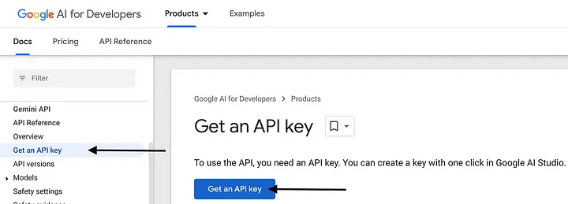
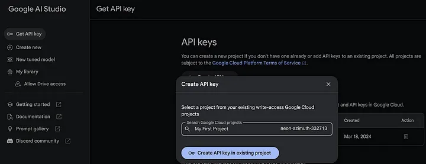
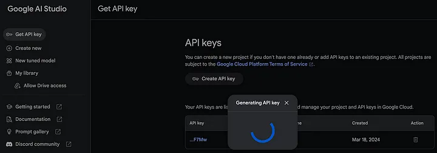
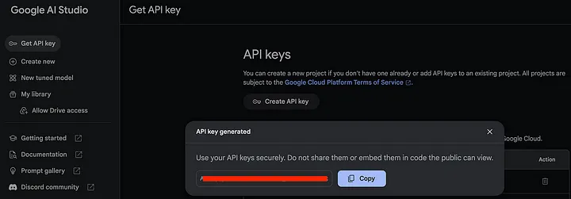
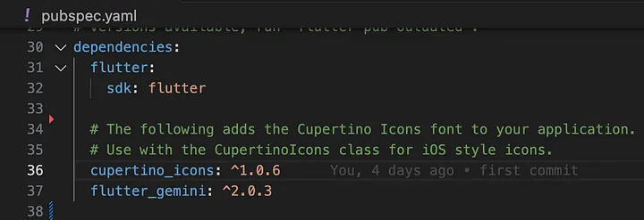

# 🚀 Integrating Gemini into Your Flutter Application

Create gemini robot 💬 chat bot 🤖 with Flutter. Show some ❤️ and star ⭐ the repo if you liked it.

###### contact for work, mail: chunhthanhde.dev@gmail.com


<a href="https://www.linkedin.com/in/chunhthanhde/">

</a>

<a href="https://www.buymeacoffee.com/chunhthanhde" target="_blank"></a>

## 📚 Overview

Integrate Google's Gemini AI into your Flutter app with ease using the `flutter_gemini` package. This guide will help you enhance your app's functionality by leveraging Gemini's advanced AI features, including multilingual support, image and audio processing, and Natural Language Processing (NLP).

## 🌟 Key Features of Gemini

- **Stream Generate Content**: Handle partial results with streaming without waiting for the complete response.
- **Text-only Input**: Complete and summarize texts using NLP.
- **Text-and-Image Input**: Use the gemini-pro-vision model for tasks involving both text and images.
- **Multi-Turn Conversations (Chat)**: Engage in dynamic conversations with follow-up questions.
- **Token Counting**: Convert information into floating-point numbers.
- **Model Info**: Retrieve details about the model, including version and input token limits.
- **EmbedContents and BatchEmbedContents**: Transform information into numerical arrays for learning.

## 🏁 Implementation Steps

1. **Obtain an API Key** 🔑
   Create an account at [Google Gemini](https://ai.google.dev/tutorials/setup).
   
    - Click on "Get API Key,"
   
      
   
    - select a Google Cloud project,
   
      
   
    - and generate your API key.
   
      
   
    - Save this key for later use.
   
      

2. **Add Dependency** 📦

   

    - Add the `flutter_gemini` package to your project by running:
      ```sh
      flutter pub add flutter_gemini
      ```

3. **Initialize Gemini** ⚙️
    - In your `main.dart` file, initialize the Gemini package with your API key:
      ```dart
      void main() {
        Gemini.init(apiKey: 'YOUR_API_KEY_HERE');
        runApp(const MyApp());
      }
      ```

4. **Create an Instance and Make Requests** 🤖
    - Use the following code to create an instance of `flutter_gemini` and handle text or image input:
      ```dart
      final _gemini = Gemini.instance;
      _gemini.textAndImage(
        text: 'Your query here',
        images: [imageFile.readAsBytesSync()],
      );
      ```

5. **Handle Responses** 🔍
    - Manage responses from Gemini with attributes such as `FinishReason` and `SafetyRating`:
      ```dart
      if (value?.finishReason != 'STOP') {
        setResponse(value?.output ?? "Invalid User Query");
      }
      if (value?.SafetyRating != 'HarmCategory') {
        setResponse(value?.candidates[0].safety_ratings);
      }
      ```

## 🚀 Demo

You can see the response from the gemini here:

<table>
<tr>
<td></td>
<td></td>
</tr>
</table>

## 🎉 Benefits

- **Easy Integration**: Simplifies adding AI features with clear documentation.
- **Cross-Platform Compatibility**: Supports Android, iOS, web, macOS, and Windows from a single codebase.
- **Reduced Time to Market**: Speeds up the integration of AI features into your app.

## 🌟 Conclusion

Integrating Google Gemini into your Flutter app with the `flutter_gemini` package opens up new possibilities for enhancing user experience. Utilize Gemini's powerful AI capabilities to add multilingual support, process images and audio, and implement advanced chatbot functionality.

## 📚 References

- [flutter_gemini Package](https://pub.dev/packages/flutter_gemini)
- [GitHub Repository](https://github.com/ChunhThanhDe/Flutter_gemini_Chat)
- [Google AI](https://ai.google.dev/)

Feel free to like and share your thoughts in the comments if you found this guide helpful! 👍